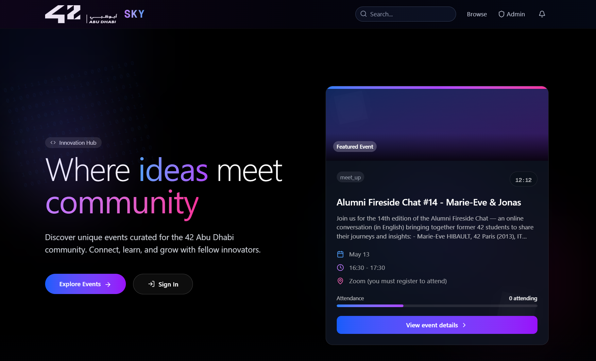

# SKY_42

An elegant event management system built specifically for 42 Abu Dhabi, providing a seamless experience for event discovery, management, and participation.

## 🌟 Features

### For Students
- **Beautiful Landing Page** showcasing upcoming events with dynamic layouts
- **Event Discovery** with filtering and search capabilities
- **Event Details** with comprehensive information and registration options
- **42 Authentication** integration for secure student login
- **Mobile-responsive** design for access on any device

### For Administrators
- **Admin Dashboard** for event management and analytics
- **Event Creation & Editing** with rich formatting options
- **Bulk Upload** functionality for events via CSV file
- **User Management** to control access and permissions
- **Desktop Mode** optimized for administrator workflows

## 📸 Screenshots

<div style="display: flex; justify-content: space-between; margin-bottom: 20px;">
  
  
</div>
<div style="display: flex; justify-content: space-between;">
  
  
</div>

## 🚀 Getting Started

### Prerequisites
- Node.js 16.x or later
- npm or yarn package manager
- 42 API credentials (for authentication)

### Installation

1. Clone the repository:
```bash
git clone https://github.com/rystik22/42_sky.git
cd 42_sky
```

2. Install dependencies:
```bash
npm install
# or
yarn install
```

3. Set up environment variables:
- Create a `.env.local` file based on `env.example`
- Add your 42 API credentials and other configuration details

4. Run the development server:
```bash
npm run dev
# or
yarn dev
```

5. Open [http://localhost:3000](http://localhost:3000) with your browser to see the application.

## 💾 Bulk Upload Format

For bulk uploading events, prepare a CSV file with the following columns:

| Column Name | Description | Example |
|-------------|-------------|---------|
| title | Event title | Introduction to AI |
| description | Event description | Learn the basics of AI and ML... |
| date | Event date (YYYY-MM-DD) | 2025-06-15 |
| time | Event time (HH:MM) | 14:30 |
| location | Event location | Lab 3, 42 Abu Dhabi |
| capacity | Maximum participants | 30 |
| imageUrl | Image URL (optional) | /images/events/ai-event.jpg |
| organizer | Event organizer | Tech Club |
| category | Event category | Workshop |

A sample CSV file is available at `samples/sample_events.csv`.

## 🔐 Authentication

### Student Login
Students can log in through the standard 42 authentication system.

### Admin Login
- **Username:** admin
- **Password:** admin123
- Note: Admin features are only accessible on desktop devices.

## 🏗️ Project Structure

```
sky42/
├── app/                # Next.js app directory
│   ├── api/            # API routes
│   ├── admin/          # Admin dashboard pages
│   ├── events/         # Event-related pages
│   ├── auth/           # Authentication pages
│   └── page.tsx        # Landing page
├── components/         # Reusable components
│   ├── common/         # Common UI components
│   ├── events/         # Event-related components
│   └── admin/          # Admin-specific components
├── lib/                # Utility functions and helpers
├── models/             # Data models
├── public/             # Static assets
│   └── images/         # Image assets
├── samples/            # Sample files
│   └── sample_events.csv # Sample CSV for bulk upload
└── styles/             # Global styles
```
## 🌐 Live Website

Visit our application: [42SKY](https://42sky.vercel.app)
## 🤝 Contributing

Contributions are welcome! Please feel free to submit a Pull Request.

1. Fork the project
2. Create your feature branch (`git checkout -b feature/amazing-feature`)
3. Commit your changes (`git commit -m 'Add some amazing feature'`)
4. Push to the branch (`git push origin feature/amazing-feature`)
5. Open a Pull Request

## 📄 License

This project is licensed under the MIT License - see the LICENSE file for details.
